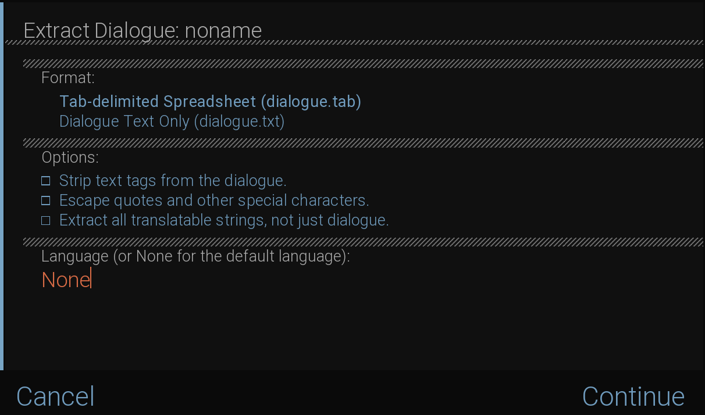

# Renpy translation to Excel and Excel to Renpy translation

## How to work

First, the script generates a excel file using `dialogue.tab` and then make a Excel file.
Whit the Excel file, you can edite and make the translation, then using this script you can 
generate a Ren'Py translation file.

### Important!

Yo need generate a Ren'Py translation first, then you can use this script to generate file.

## What i need delete in tl folder?

You need delete **only** the script will contains dialogues and screens text. 

example: screen.rpy, scripts.rpy

> This script doesn't generate the common.rpy file/content.

## How to install and use

First, you need install some libraries.

```bash
$ pip install -r ./requirements.txt
```
Now you need generate a Ren'Py dialogue file.

How to generate:


put the dialogue.tab file in the same folder of this script.

Example:
```
folder/
├── dialogue.tab
└── main.py
```
Then you can run the script.

```python
python3 main.py
```

You will see this messages:

```
1) Generate excel file for translators
2) Generate a new tl (.rpy) file with the excel file
3) Close
```

Now you need use this commands in order to generate the TL Ren'Py file.

1) Generate excel file for translators

2) Generate a new tl (.rpy) file with the excel file

> You do not need to delete the files that are located in the ./out/ folder when you update the dialogue.tab file, since they are generated again from 0.


## How to add on your project

cut the file in `out/rpy/*.rpy` and paste it in your tl folder.
```
game/
├── tl/
    ├── [folder]/
        ├── [file].rpy

```


# Important notes:

You may not get the script.rpy or screen.rpy files generated again if you regenerate the translation, don't panic. This is because they are now in a single file.

Now, instead of generating a translation update (dialogs, screens) as we normally do, we will have to extract the dialogs together with the translatable strings.

Dialogue.tab does not take into account native renpy screens, so only translatable strings that exist inside the ./game or .game/* folder will be generated.